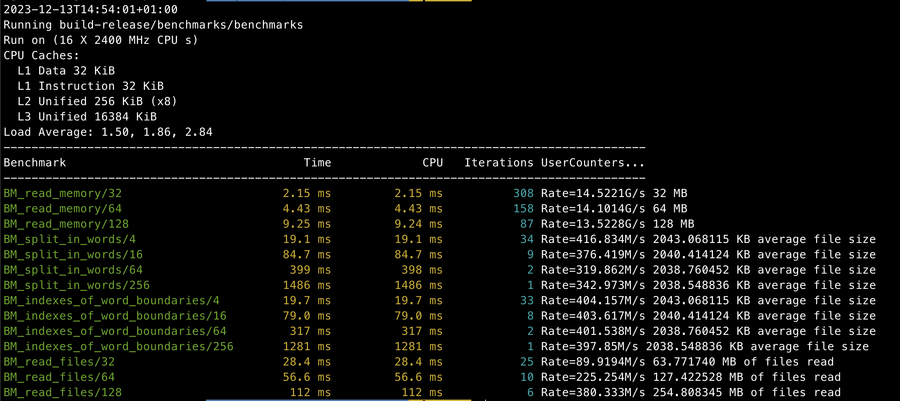

# Words counter benchmarks

This is a series of a increasingly more performant words counters.

(Unscientific) Performance comparisons are shown for each implementation below 
on the 2 machines I tried myself.


So far, there are:

  - A monothread version
  - A simple futures multithreaded version
  - A futures version with thread pools for more load balancing
  - A futures version with memory mapped files and thread pools balancing
  - A coroutine-based read file implementation (Linux Only, Asio + uring)
  
  
You can run the benchmarks and experiment freely with those.

The benchmarks includes internal profiling for the different stages of 
`BoostFutureMemMappedFileWordsCounter` words counter implementation when 
enabled via meson options. 

You can run all implementation `run-words-counter-implementations.sh`.
The results will be stored in `words-counter-results/` directory.

If you want to experiment further with the binary itself, just check the command lines inside
the script. You have a `--help` option in the binary program itself to figure out how it works.

WARNING: the program has been tested under MacOS and Linux on my machines only.
If you have any trouble, please contact me.

## Requirements


  - gcc12 in Linux or gcc13 in MacOS
  - conan at least 1.62.0
  - python3
  - ninja build system
  - meson build system at least 1.3.0
  
  
### Linux

``` sh
# This can take a while since Conan will download packages and probably build
meson setup -Dbuildtype=release build-release

# Please, note that for the first time the compilation stage could look stuck.
# This is because it needs to download the file resources needed to use the program and uncompress.
meson compile -C build-release

# Run benchmarks
meson test --benchmark -v -C build-release

# Run implementations
./run-words-counter-implementations.sh
```

### MacOS 

``` sh

# This can take a while since Conan will download packages and probably build
meson setup -Denable_internal_profiling=true -Dconan_profile=gcc13_macos --native-file meson/native/compilers/gcc13_macos.ini -Dbuildtype=release build-release

# Please, note that for the first time the compilation stage could look stuck.
# This is because it needs to download the file resources needed to use the program and uncompress.
meson compile -C build-release

ulimit -n 10240
# Run benchmarks
meson test --benchmark -v -C build-release

# Run implementations
./run-words-counter-implementations.sh
```


## Results

### Benchmark run results example




### Results for each implementation (MacOS)

Macbook Pro late 2019.
2,4 GHz Intel Core i9 de 8 cores with multithreading.
32 GB 2667 MHz DDR4.
APPLE SSD AP0512N.

#### MonoThreadWordsCounter

```
MiB read: 2041.65
Execution time: 62.867s
Processing speed: 32.48 MiB/s
Number of files processed: 1024
Words/s: 5437369.1
```


#### AsyncWordsCounter

```
MiB read: 2041.65
Execution time: 22.136s
Processing speed: 92.23 MiB/s
Number of files processed: 1024
Words/s: 15442314.8
```

#### ExecutorBasedFutureWordsCounter

```
MiB read: 2037.65
Execution time: 17.919s
Processing speed: 113.71 MiB/s
Number of files processed: 1024
Words/s: 19076459.7

```

#### BoostFutureMemMappedFileWordsCounter 

```
Count words threads: 5. Split words threads: 4. Merge results threads: 7

        Split words/nthreads: (2.92412675s (normalized: 0.264142732457078)
        Count words/nthreads: 3.9666942s (normalized: 0.3583201189242713)
        Merge results/nthreads: 4.179431571428571s (normalized: 0.37753714861865073)
        

MiB read: 2037.65
Execution time: 6.93s
Processing speed: 294.03 MiB/s
Number of files processed: 1024
Words/s: 49326271.6
```


### Results for each implementation (Linux)

Intel(R) Core(TM) i5-7500 CPU @ 3.40GHz. 
32 GB RAM DDR4 2400 Mhz. 
Kingston SA400S3 SSD.

#### MonoThreadWordsCounter

```
MiB read: 2041.66
Execution time: 49.897s
Processing speed: 40.92 MiB/s
Number of files processed: 1024
Words/s: 6851865.5
```


#### AsyncWordsCounter

```
MiB read: 2041.66
Execution time: 35.707s
Processing speed: 57.18 MiB/s
Number of files processed: 1024
Words/s: 9574804.2
```

#### ExecutorBasedFutureWordsCounter

```
MiB read: 2037.66
Execution time: 24.673s
Processing speed: 82.59 MiB/s
Number of files processed: 1024
Words/s: 13856747.6
```

#### BoostFutureMemMappedFileWordsCounter 

```
MiB read: 2037.66
Execution time: 16.694s
Processing speed: 122.06 MiB/s
Number of files processed: 1024
Words/s: 20479665.3
```

#### ThreadPoolWithCoroutine (only Linux)

``` 
MiB read: 2037.66
Execution time: 13.162s
Processing speed: 154.81 MiB/s
Number of files processed: 1024
Words/s: 25975348.2
```

